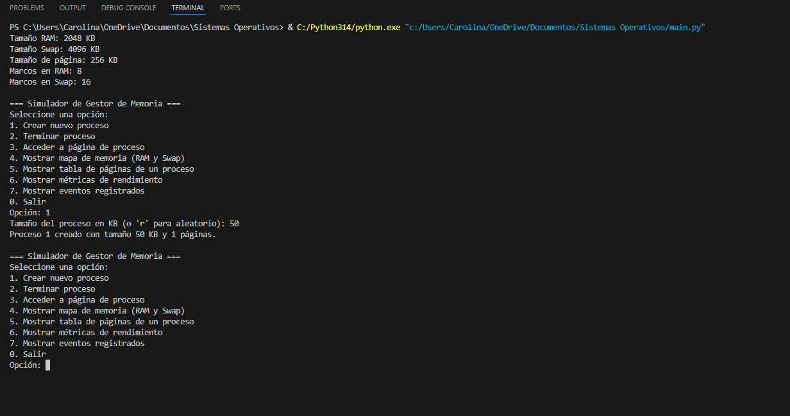
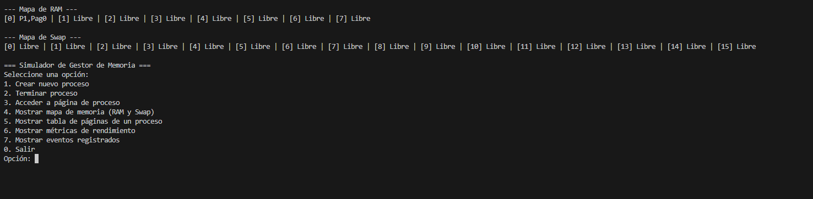

# Simulador de Gestión de Memoria – Paginación y Swapping

**Autores:**  
Carolina Farrera Ramírez  
Lluvia Rubí Hernández Flores

Este proyecto implementa un **simulador funcional** del gestor de memoria de un sistema operativo, empleando paginación y un área de intercambio (swap).  Está diseñado para ayudar a comprender cómo un kernel asigna memoria física a procesos multiprogramados, traduce direcciones lógicas y gestiona la memoria virtual cuando la RAM se agota.

## 🎯 Objetivos del proyecto

El simulador tiene como finalidad que el estudiante:

* Modele y comprenda el comportamiento interno del gestor de memoria de un SO.
* Aplique conceptos teóricos de paginación, tablas de páginas, TLB y swapping.
* Registre métricas de rendimiento (accesos totales, fallos de página, tasa de fallos, swaps de salida y entrada, ocupación de RAM y Swap, TLB hits y misses) y visualice el estado de la memoria.
* Produzca documentación clara y estructurada y un repositorio reproducible.

## 🧠 Descripción general

El simulador está desarrollado en **Python 3** con una interfaz de línea de comandos (CLI).  Lee el archivo de configuración `config.ini` para establecer:

* Tamaño total de la memoria física (RAM)
* Tamaño del área de intercambio (Swap)
* Tamaño de página/marco

Al crear procesos, calcula cuántas páginas necesita cada uno y las asigna a marcos libres.  Cuando la RAM se llena se activa un algoritmo de reemplazo **FIFO (First‑In, First‑Out)** que expulsa la página más antigua y la mueve al área de swap.  El sistema mantiene una TLB (Translation Lookaside Buffer) con política LRU para acelerar la traducción de direcciones.

## 📂 Estructura del repositorio

```
simulador-gestor-memoria/
├── src/           # Código fuente del simulador
│   ├── config.py  # Lectura de config.ini y cálculo de marcos
│   ├── process.py # Clase Process con tabla de páginas y estados
│   ├── memory_manager.py  # Gestor de memoria, RAM, Swap, TLB y reemplazo
│   ├── replacement.py     # Interfaz y algoritmo FIFO (base para LRU/clock)
│   ├── logger.py  # Registro de eventos y métricas
│   ├── cli.py     # Interfaz de línea de comandos
│   └── main.py    # Punto de entrada para ejecutar el simulador
├── docs/
│   ├── manual_usuario.md  # Manual de usuario
│   ├── manual_tecnico.md  # Manual técnico
│   ├── reporte_tecnico.md # Informe técnico en Markdown
│   ├── reporte_tecnico.pdf # Informe técnico en PDF
│   └── img/   # Capturas de pantalla y diagramas
│       ├── menu_principal.png
│       ├── mapa_memoria.png
│       ├── acceso_pagina.png
│       ├── tabla_paginas.png
│       ├── metricas.png
│       └── logs.png
├── tests/
│   └── ejemplo_log.txt    # Ejemplo de ejecución con registros
├── config.ini   # Parámetros de la simulación (RAM, Swap, página)
└── README.md    # Documento actual
```

## ⚙️ Instalación y ejecución

1. **Prerrequisitos**: se requiere Python 3.10 o superior.  No se necesitan bibliotecas adicionales.
2. **Configurar parámetros**: edite `config.ini` para indicar el tamaño de la RAM y del swap (en KB) y el tamaño de página.  Ejemplo de configuración:

   ```ini
   [MEMORY]
   RAM_SIZE_KB = 2048
   SWAP_SIZE_KB = 4096
   PAGE_SIZE_KB = 256
   ```

3. **Ejecutar el simulador**:

   En la raíz del repositorio, ejecute:

   ```bash
   python src/main.py
   ```

   Al iniciar, el programa mostrará un resumen de la configuración y el siguiente menú interactivo:

   ```
   === Simulador de Gestor de Memoria ===
   1. Crear nuevo proceso
   2. Terminar proceso
   3. Acceder a página de proceso
   4. Mostrar mapa de memoria (RAM y Swap)
   5. Mostrar tabla de páginas de un proceso
   6. Mostrar métricas de rendimiento
   7. Mostrar eventos registrados
   0. Salir
   ```

## 🧩 Resumen del diseño e implementación

### Paginación y tablas de páginas

Cada proceso se divide en páginas de tamaño fijo.  Una tabla de páginas por proceso almacena el estado de cada página (presencia en RAM, índice de marco, índice de swap y bit de referencia).  La estructura de datos se implementa con diccionarios.

### Memoria RAM y Swap

La RAM y el swap se modelan como listas de marcos (`Frame`) con campos `process_id` y `page_number`.  Una página se considera libre si ambos campos son `None`.  Cuando la RAM se llena, la política FIFO selecciona la página más antigua para enviarla al swap liberando espacio para la nueva página.

### TLB y algoritmos de reemplazo

Una TLB con política LRU almacena las traducciones más recientes para acelerar accesos.  El algoritmo de reemplazo implementado es FIFO, pero el diseño modular permite añadir LRU o reloj implementando una nueva clase en `replacement.py`.

### Métricas y registros

El simulador recopila y muestra un conjunto completo de métricas para evaluar el rendimiento de la gestión de memoria:

* **Accesos totales**: número total de referencias a páginas realizadas durante la ejecución.
* **Fallas de página**: cantidad de accesos que resultaron en un traslado de la página desde Swap a la RAM.
* **Tasa de fallos de página**: porcentaje de fallos de página respecto a los accesos totales.
* **Swaps de salida (RAM → Swap)**: número de páginas expulsadas de la memoria física debido a falta de marcos libres.
* **Swaps de entrada (Swap → RAM)**: número de páginas traídas desde la Swap a la RAM para atender un acceso.
* **Ocupación de RAM y de Swap**: porcentaje de marcos ocupados en cada región de memoria en el momento de la consulta.
* **TLB hits y misses**: número de accesos que encontraron una traducción válida en la TLB frente a los que necesitaron consultar la tabla de páginas.

Además, todos los eventos (creación y terminación de procesos, accesos a páginas, fallos de página y swaps) se registran en un archivo de log (`logger.py`) y pueden visualizarse mediante la opción correspondiente del menú.

## 📸 Ejemplo de ejecución
Las siguientes imágenes muestran el simulador en ejecución real:

### Inicio del simulador y creación de procesos



### Visualización de RAM y Swap



## 🔧 Posibles mejoras

* Implementar algoritmos de reemplazo LRU o reloj.
* Añadir una interfaz gráfica (GUI) para visualizar la memoria de forma más amigable.
* Permitir la configuración del tamaño de la TLB y su política.
* Exportar métricas a formato CSV para análisis externo.

## 📝 Licencia

Este proyecto se distribuye bajo la licencia MIT.  Consulte el archivo `LICENSE` para más detalles.