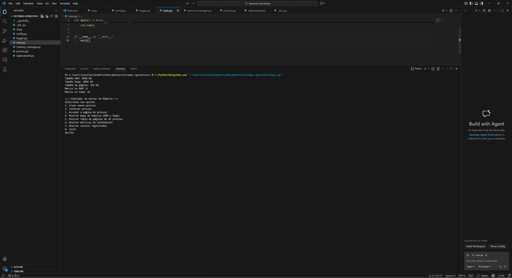
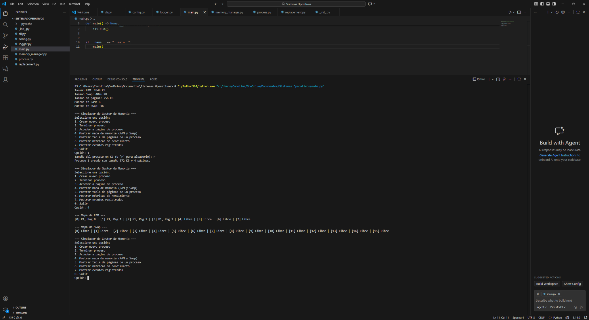

# Manual Técnico

El **Manual Técnico** proporciona una descripción detallada de la arquitectura, las estructuras de datos y el funcionamiento interno del simulador de gestión de memoria.  El objetivo es documentar los conceptos empleados y facilitar el mantenimiento y la extensión futura del software.

## 1. Arquitectura general

El simulador está organizado en módulos independientes alojados en la carpeta `src`.  Cada módulo encapsula una responsabilidad específica y colabora con los demás a través de interfaces bien definidas.  La siguiente figura lógica resume la arquitectura:

```
┌───────────┐     ┌─────────────┐     ┌─────────────────┐
│  cli.py   │ -->│ MemoryManager│<--> │ replacement.py  │
└─────┬─────┘     └───────┬─────┘     └─────────────────┘
      │                  │
      │                  ▼
      │            ┌────────────┐
      │            │  process.py│
      │            └────────────┘
      ▼
┌────────────┐
│  config.py │
└────────────┘
```

* **config.py**: Carga el archivo `config.ini` y expone un objeto `Config` con los parámetros de tamaño de RAM, tamaño de Swap y tamaño de página.  También calcula cuántos marcos existen en cada memoria en función del tamaño de página【823107480250600†L50-L58】.
* **process.py**: Define la clase `Process` que encapsula el identificador único del proceso (PID), su tamaño en KB, el número de páginas requeridas y la tabla de páginas.  Cada entrada de la tabla (`PageTableEntry`) contiene los bits de presencia y referencia, el índice de marco en RAM y el índice de marco en Swap.
* **memory_manager.py**: Implementa el gestor de memoria.  Mantiene dos listas de `Frame` (una para RAM y otra para Swap) que representan los marcos de memoria física.  Ofrece métodos para agregar y eliminar procesos, asignar páginas, acceder a páginas, realizar swapping y devolver estadísticas de rendimiento.  También gestiona una cola FIFO para seleccionar páginas víctimas y una tabla TLB (Translation Lookaside Buffer) con política LRU para acelerar las traducciones.
* **replacement.py**: Contiene la clase abstracta `ReplacementAlgorithm` y la implementación concreta `FIFOReplacement`.  Esta estructura permite añadir otras políticas de reemplazo como LRU o Clock sin modificar el gestor de memoria【823107480250600†L88-L93】.
* **logger.py**: Proporciona una clase `Logger` para registrar mensajes de eventos (creación y terminación de procesos, operaciones de swapping, fallos de página, etc.).
* **cli.py**: Ofrece una interfaz de texto para interactuar con el simulador; lee entradas del usuario, ejecuta operaciones en el `MemoryManager` y muestra los resultados.
* **main.py**: Punto de entrada del programa.  Instancia la clase `CLI` y ejecuta su método `run()` para iniciar el ciclo interactivo.

## 2. Estructuras de datos

### 2.1 Marco de memoria (`Frame`)

Se modela como una estructura simple con dos campos: `process_id` y `page_number`.  Un marco está libre cuando ambos son `None`.  Existen dos listas de marcos: `ram` y `swap`, cuyos tamaños se calculan en función del archivo de configuración【823107480250600†L50-L58】.

### 2.2 Proceso y tabla de páginas

Cada `Process` mantiene su propio diccionario `page_table` donde la llave es el número de página lógica y el valor es un objeto `PageTableEntry`.  Este objeto contiene:

* `present` (bool): indica si la página está en RAM.
* `frame_index` (opcional int): índice del marco en RAM cuando `present` es verdadero.
* `swap_index` (opcional int): índice del marco en Swap cuando la página ha sido intercambiada.
* `referenced` (bool): bit de referencia utilizado por algoritmos como LRU o Clock.

### 2.3 Cola de reemplazo y TLB

El `MemoryManager` mantiene una **cola FIFO** (`page_queue`) que almacena tuplas `(pid, page_number)` en el orden en que fueron cargadas a la RAM.  Cuando no hay marcos libres, la cola permite identificar la página víctima (FIFO) para ser movida a Swap【823107480250600†L88-L99】.

La **TLB** es una lista limitada a 4 entradas donde cada entrada almacena un diccionario con `pid`, `page_number` y `frame_index`.  Se utiliza la política LRU: cada vez que hay un acceso exitoso a una página, la entrada correspondiente se mueve al final de la lista; cuando la TLB está llena, se descarta la entrada más antigua.

## 3. Funcionamiento de las operaciones principales

### 3.1 Creación de procesos

Cuando se crea un proceso, el `MemoryManager` calcula cuántas páginas necesita y recorre cada número de página para asignar un marco.  Se buscan marcos libres en RAM; si la RAM está llena, se invoca la rutina de swapping (3.3).  Después de cada asignación, se añade la tupla `(pid, page_number)` a la cola FIFO y se actualiza la TLB con la nueva traducción.

### 3.2 Acceso a página

Cuando un usuario accede a una página mediante la CLI, el gestor procede de la siguiente manera:

1. Comprueba la TLB para encontrar una traducción rápida.  Si hay un **TLB hit**, se retorna el marco físico inmediatamente.
2. Si no se encuentra en la TLB, se consulta la tabla de páginas.  Si la página está en RAM (`present=True`), se actualiza el bit de referencia y la TLB.
3. Si la página no está en RAM pero tiene un `swap_index`, se produce un **fallo de página**.  Se incrementa el contador de fallos, se libera el marco en Swap y se invoca el algoritmo de asignación para traer la página a RAM, reemplazando otra página si es necesario.  La TLB se actualiza con la nueva traducción.
4. Si la página no está en RAM ni en Swap, se devuelve un error indicando que la página no está asignada.

### 3.3 Swapping y reemplazo de páginas

Al no haber marcos libres en RAM, el gestor ejecuta el siguiente flujo:

1. **Selección de víctima**: se extrae la primera tupla de la cola FIFO para obtener `(victim_pid, victim_page_number)` y se verifica que esa página sigue presente en RAM; en caso contrario, se avanza hasta encontrar una página válida.【823107480250600†L88-L99】.
2. **Movimiento a Swap**: se busca el primer marco libre en la lista `swap` y se copia la información del marco de RAM seleccionado.  La entrada de la tabla de páginas del proceso víctima se actualiza (`present=False`, `swap_index=idx`) y se liberan los datos del marco en RAM.  También se invalida la traducción en la TLB.
3. **Asignación al nuevo proceso**: se asigna el marco liberado al nuevo proceso/página, se actualiza su tabla de páginas y se inserta en la cola FIFO y en la TLB.
4. El `Logger` registra un mensaje con la página víctima, el PID y el marco de Swap utilizado.

## 4. Métricas y registros

El simulador recopila estadísticas de rendimiento:

* **Fallas de página**: se incrementan cada vez que se accede a una página que no está en RAM【823107480250600†L88-L99】.
* **Operaciones de swapping**: se incrementan cada vez que una página es movida de RAM a Swap o viceversa.
* **Utilización de RAM**: se calcula como el número de marcos ocupados sobre el total de marcos disponibles.

Los logs permiten auditar qué páginas fueron intercambiadas y en qué momento.  Estos registros son útiles para comprender la dinámica del algoritmo de reemplazo y verificar el funcionamiento del simulador.

## 5. Consideraciones de extensión

El diseño modular permite incorporar otras políticas de reemplazo (LRU o reloj) simplemente implementando una nueva clase que herede de `ReplacementAlgorithm` y suministrarla al `MemoryManager`.  Asimismo, podría añadirse una interfaz gráfica o exportar las métricas para su análisis externo.  El tamaño de la TLB y la política asociada también se pueden parametrizar para experimentar con distintos comportamientos.

## 6. Evidencia de ejecución del sistema

A continuación se muestran capturas de una ejecución real del simulador, que permiten observar la interacción por consola y la representación de la memoria.

### Ejecución de la CLI

En esta captura se aprecia el menú del simulador y la ejecución de las opciones para crear procesos y mostrar la memoria:



### Representación de la memoria RAM y Swap

La siguiente captura muestra el estado de la memoria tras crear procesos, donde se puede observar cómo se asignan páginas a marcos y qué marcos están libres en RAM y en swap:


